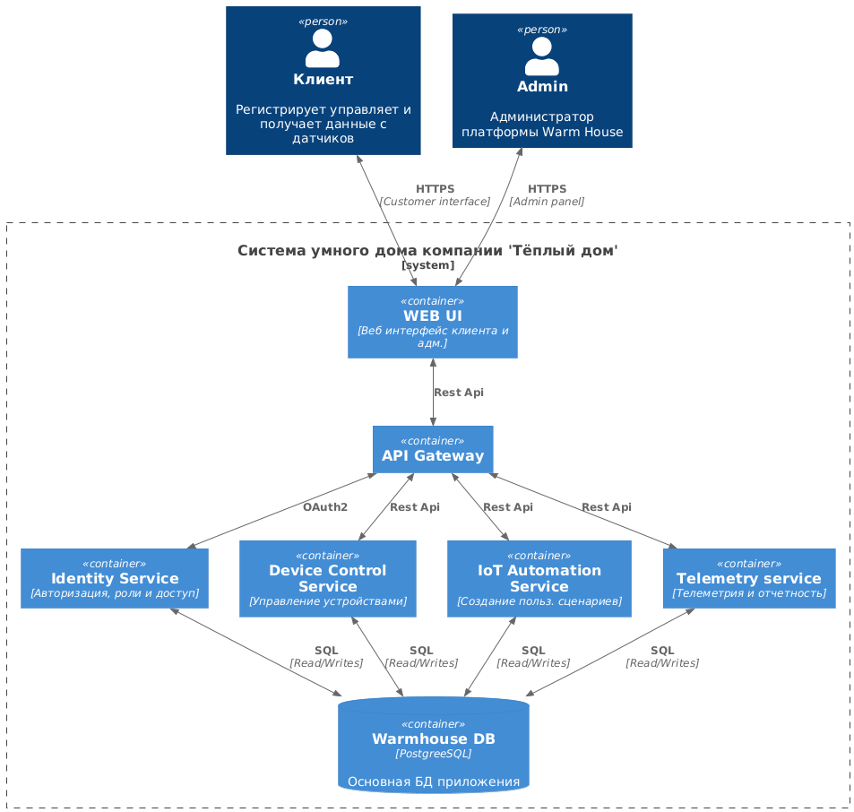
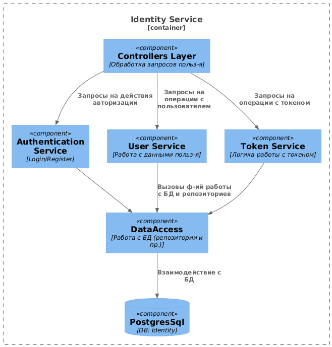
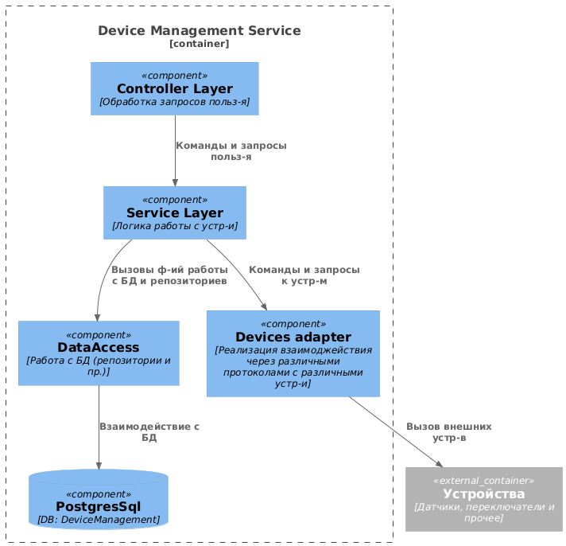
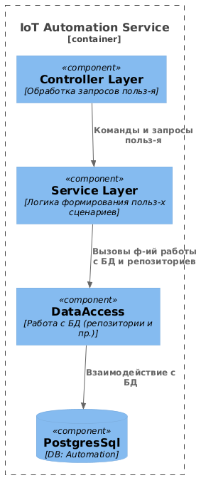
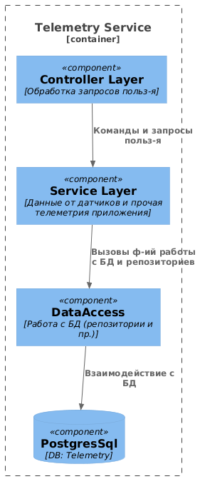
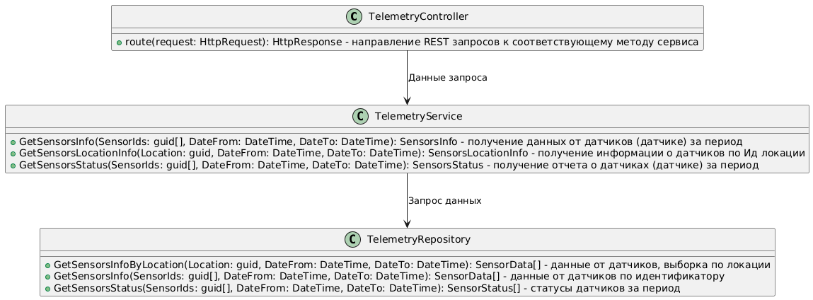
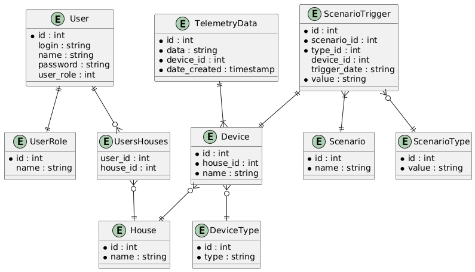

# Задание 1. Анализ и планирование

### 1. Описание функциональности монолитного приложения

**Управление отоплением:**

- Пользователи могут удалённо включать/выключать отопление в своих домах.
- Система поддерживает добавление/удаление/обновление данных о датчиках температуры

**Мониторинг температуры:**

- Пользователи могут просматривать текущую температуру в своих домах через веб-интерфейс.
- Система поддерживает получение данных о температуре по ID датчика либо по указанной локации.

### 2. Анализ архитектуры монолитного приложения

- Язык программирования: GO.
- База данных: PostgreSQL 16.
- Взаимодействие между модулями: Синхронное.
- Архитектурный стиль: Монолит.
- Развертывание: Требует остановки всего приложения.

### 3. Определение доменов и границы контекстов

**Домен сенсоров**

Все операции связанные с сенсорами температуры

**Поддомен управления сенсорами**
- CRUD операции работы с сенсорами

**Поддомен мониториринга данных с устройств (температура)**
- Получение информации о температуре по ИД сенсора или локации

### **4. Проблемы монолитного решения**

- Необходима остановка всего приложения при доработках
- Проблемная масштабируемость отдельных компонентов (если одни модули более нагружены чем другие)
- Разрастание кодовой базы проекта, и повышение порога входа для новых разработчиков, равно как и запутывание архитектуры приложения со временем
- Усложнение тестирования со временем, при увеличении проекта

### 5. Визуализация контекста системы — диаграмма С4

[Диаграмма контекста](schemas/monolith/plantuml_export.puml)


# Задание 2. Проектирование микросервисной архитектуры

В этом задании вам нужно предоставить только диаграммы в модели C4. Мы не просим вас отдельно описывать получившиеся микросервисы и то, как вы определили взаимодействия между компонентами To-Be системы. Если вы правильно подготовите диаграммы C4, они и так это покажут.

**Диаграмма контейнеров (Containers)**

[Диаграмма контейнеров](schemas/newapp/containers.puml)



**Диаграмма компонентов (Components)**

- [Диаграмма сервиса авторизации](schemas/newapp/identity_service_conteiner.puml)


- [Диаграмма сервиса управления устройствами](schemas/newapp/device_management_service_container.puml)


- [Диаграмма сервиса создания польз-х сценариев](schemas/newapp/automation_service_container.puml)



- [Диаграмма сервиса телеметрии и отчетов](schemas/newapp/telemetry_service_container.puml)


**Диаграмма кода (Code)**

- [Диаграмма кода сервиса телеметрии и отчетов](schemas/newapp/telemetry_service_code.puml)



# Задание 3. Разработка ER-диаграммы

[ER-диаграмма](schemas/newapp/emdiagram.puml)

# Задание 4. Создание и документирование API

### 1. Тип API

Для взаимодействия веб-клиента и сервера стоит использовать REST API, т.к. RPC протоколы либо не поддерживаются либо ограниченны в поддержке.
Для взаимодействия микросервисов лучше использовать RPC (например gRPC), так как она обеспечивает бинарную и потоковую передачу данных. Но если команда/компания не работала с таким протоколом, а приложение не выглядит слишком объемным то более привычным решением будет REST API. Выберу REST API.

### 2. Документация API

[Сервис автоматизации пользовательских сценариев](schemas/newapp/IoTAutomationService.json)

# Задание 5. Работа с docker и docker-compose

Перейдите в apps.

Там находится приложение-монолит для работы с датчиками температуры. В README.md описано как запустить решение.

Вам нужно:

1) сделать простое приложение temperature-api на любом удобном для вас языке программирования, которое при запросе /temperature?location= будет отдавать рандомное значение температуры.

Locations - название комнаты, sensorId - идентификатор названия комнаты

```
	// If no location is provided, use a default based on sensor ID
	if location == "" {
		switch sensorID {
		case "1":
			location = "Living Room"
		case "2":
			location = "Bedroom"
		case "3":
			location = "Kitchen"
		default:
			location = "Unknown"
		}
	}

	// If no sensor ID is provided, generate one based on location
	if sensorID == "" {
		switch location {
		case "Living Room":
			sensorID = "1"
		case "Bedroom":
			sensorID = "2"
		case "Kitchen":
			sensorID = "3"
		default:
			sensorID = "0"
		}
	}
```

2) Приложение следует упаковать в Docker и добавить в docker-compose. Порт по умолчанию должен быть 8081

3) Кроме того для smart_home приложения требуется база данных - добавьте в docker-compose файл настройки для запуска postgres с указанием скрипта инициализации ./smart_home/init.sql

Для проверки можно использовать Postman коллекцию smarthome-api.postman_collection.json и вызвать:

- Create Sensor
- Get All Sensors

Должно при каждом вызове отображаться разное значение температуры

Ревьюер будет проверять точно так же.

**Решение:**

Директория apps содержит решение: докер файл и сервис.

# **Задание 6. Разработка MVP**

Необходимо создать новые микросервисы и обеспечить их интеграции с существующим монолитом для плавного перехода к микросервисной архитектуре.

**Решение:**

Насколько пояснил Наставник - решение этого задания должно включать предыдущее, чтобы не испортить предыдущее задание, я собрал его в отдельной директории /Task6.

Чтобы избежать асинхронной интеграции, я предположил что новое приложение, частью которого будет являться telemetry-service и device-control-service, могли бы ходить в датчики подключенные в старом приложении, заранее имея у себя необходимую таблицу этих датчиков и принимая инф-ю с них через старый "smart_home".
